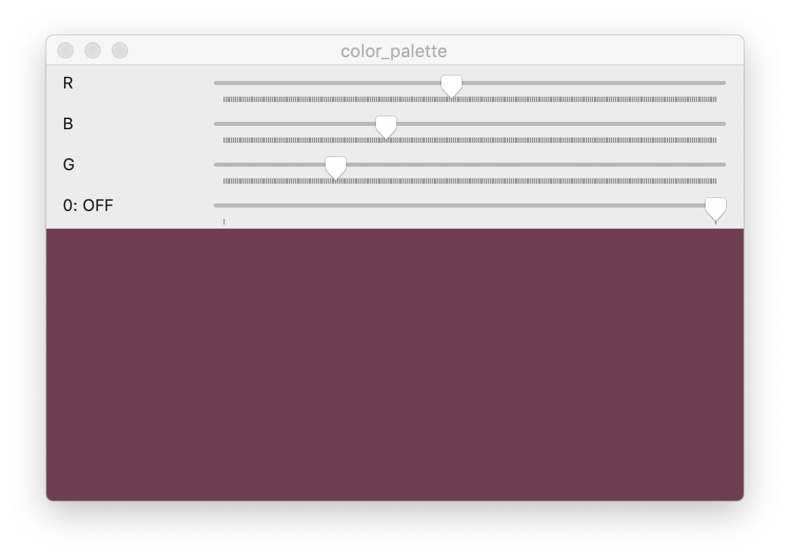

# Trackbar using

 트랙바 활용하기

* **코드**

  ```python
  import numpy as np
  import cv2
  
  # 트랙바 이벤트 처리 콜백 함수
  def onChange(x) :
      pass
  
  def trackbar():
      # 200 x 512 크기의 검정색 그림판 생성
      img = np.zeros((200, 512, 3), np.uint8)
      # color_palette 윈도 생
      cv2.namedWindow('color_palette')
  
      # 트랙바를 지정된 윈도우에 생성 함수
      # createTrackbar(trackbarname, windowname, start, end, onChnage)
      # start : 시작 값
      # end : 끝 값
      # onChange : 트랙바 이벤트 발생시 수행되는 콜백 함수
      cv2.createTrackbar('B', 'color_palette', 0, 255, onChange)
      cv2.createTrackbar('G', 'color_palette', 0, 255, onChange)
      cv2.createTrackbar('R', 'color_palette', 0, 255, onChange)
  
      switch = '0: OFF\n1: ON'
      cv2.createTrackbar(switch, 'color_palette', 0, 1, onChange)
  
      while True:
          cv2.imshow('color_palette', img)
          k = cv2.waitKey(1)
  
          if k == 27:
              break
  
          # 트랙바의 현재 위치를 리턴하는 함수
          # 파라미터 : (트랙바 이름, 트랙바가 생성된 윈도우 이름)
          b = cv2.getTrackbarPos('B', 'color_palette')
          g = cv2.getTrackbarPos('G', 'color_palette')
          r = cv2.getTrackbarPos('R', 'color_palette')
          s = cv2.getTrackbarPos(switch, 'color_palette')
  
          # 스위치가 On/Off 일때의 처리
          if s == 0:
              img[:] = 0
          else :
              img[:] = [b, g, r]
  
      cv2.destroyAllWindows()
  
  trackbar()
  ```

* **실행 결과**

  

  